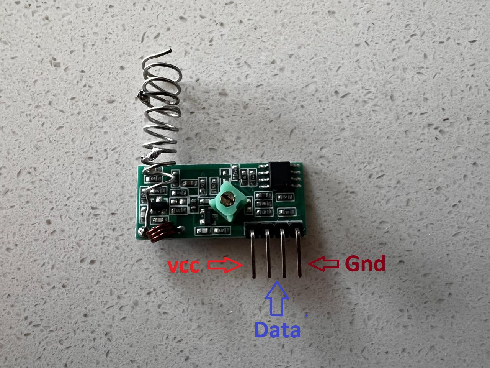
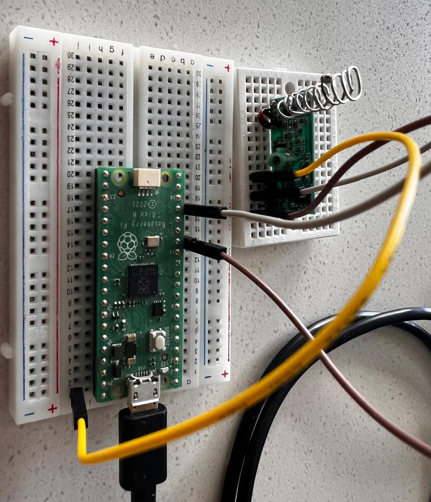
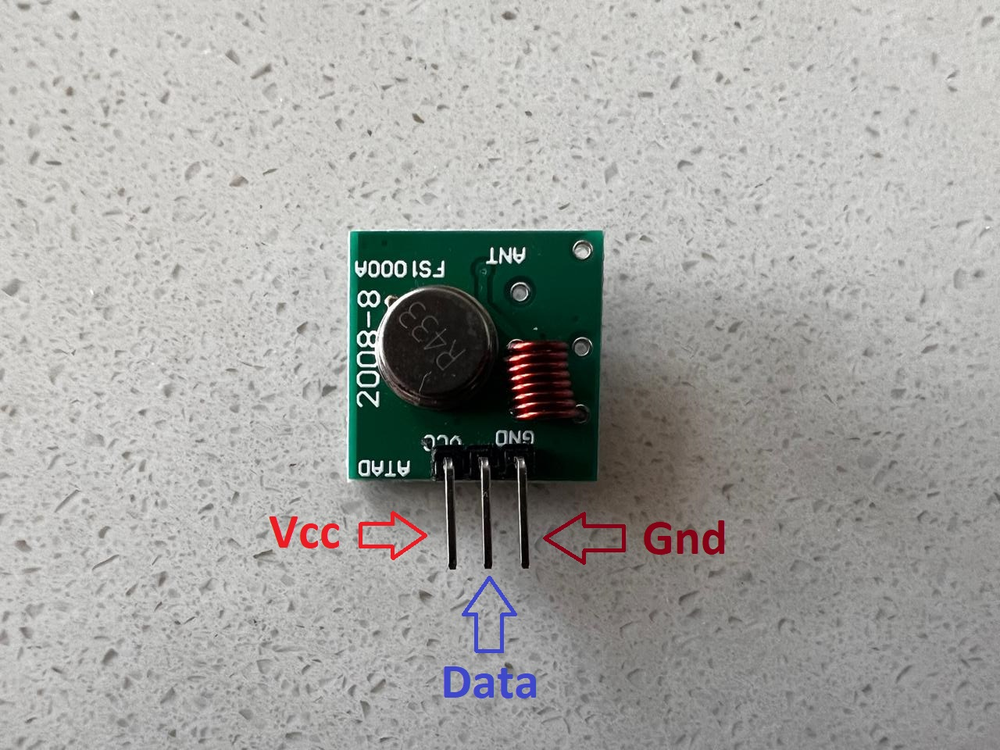
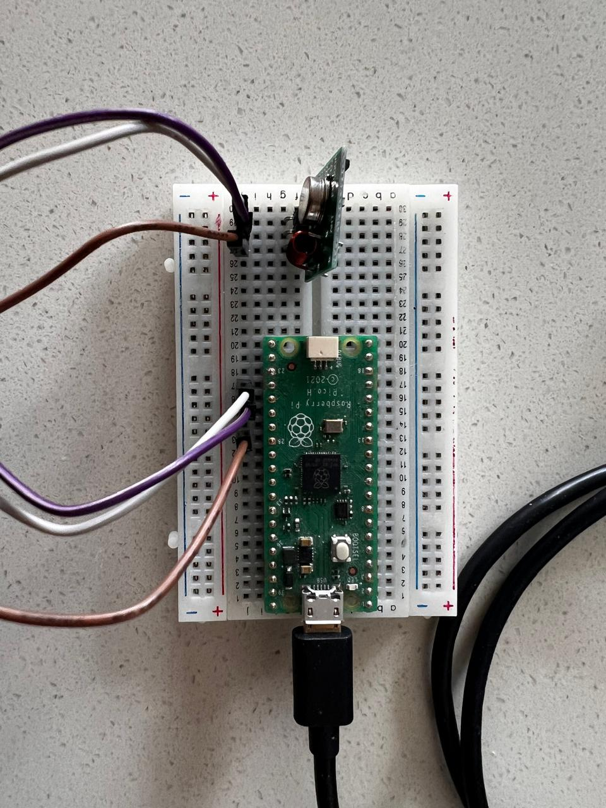
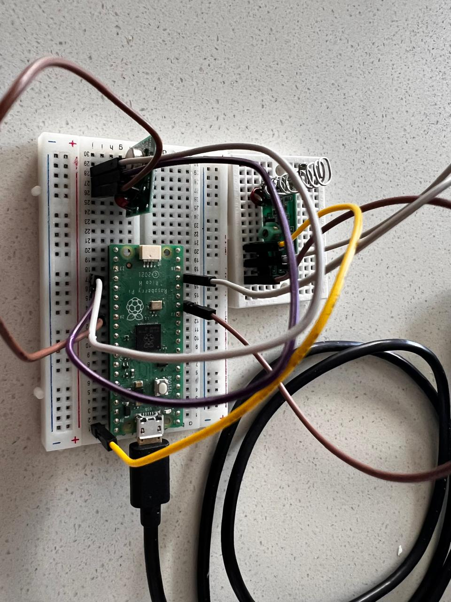

# Pico 433Mhz RF Module Library
v.2.0

This library is intended for use in a Raspberry Pi Pico microcontroller to handle digital signals from a 433 Mhz RF module. You can find this module on [Amazon](https://www.amazon.com/HiLetgo-Wireless-Transmitter-Receiver-Raspberry/dp/B01DKC2EY4/ref=sr_1_3?dib=eyJ2IjoiMSJ9.tNlJbSBQOEL92GF5uwdw_3SL16TQy5q53ghPMyP1cHEsrLxGHSv_Hrk051zSYoIKOV3SQOxT8WlPG1fWqBXTT2qJziGxOrVbRX8AA7w0lYnlZSmpK8G69bdIipY7qC98s63Tp4Auc2GXPUjxvkEA17zSVrBe0Hu2DsSEkeMOCp1ocImWadqcHmnRnU0TwXfq4_TeJ5_5FVu8ZNVvSN_ARLaKOvYZicok_mjMqcb6nTQ.SDqOOcts__5t69TnLcj5LbM_DOp22w5x4iSZq723qCQ&dib_tag=se&keywords=433mhz+receiver&qid=1710655441&sr=8-3). This module is perfect for simple short-range communication, whether it is to control your room LEDs or disable an alarm system. This module is cheap and easy to use. 

Resources: this library was developed with the help of [robwlakes](https://github.com/robwlakes/ArduinoWeatherOS)'s repository. They also explain in full detail how Manchester Encoding works, so I recommend giving a visit to their repository. 

## What the library does: 

This library handles radio frequency communication using Manchester Encoding. The library contains two classes, one for the receiver and one for the transmitter. Currently, the receiver can read up to 125 bytes per second, which is expected to increase with some future optimizations. Both the receiver and transmitter can use Manchester Encoding as per G.E Thomas or IEEE convention(more about this below). All data transmission is treated as sending packages, which uses a simple framing of a header/preamble, a package size flag, and the payload. Overall, this is an easy way to send and receive information in your Raspberry Pi Pico project through radio frequency. 

## Quick-start Guide:
First, download the Pico433Lib.py file and import it into your Pico.

### For the receiver: 
```python
from machine import Pin
from Pico433Lib import Rx

#The header is a sequence of bits the receiver expects before the payload. You can make the header any binary sequence as long as it starts with a one. I recommend keeping it at least 6 bits long. 
header = [1,1,1,1,1,1,1,1]

#For this function, use the pin you have your RF module output connected to as the first argument, in this example I'm using GPIO pin 13. For the second argument, choose either 0 or 1 to use the original Manchester Encoding or as per IEEE convention(more about this below) respectively. For the third argument, use the header array.
rx = Rx(13, 0, header)

#Note: For the receiver linked above, you'll need to connect the voltage directly into the VSYS pin of your pico as it requires 5v. If you have a receiver that works with 3v then you can use any other GPIO pin. 

#For this example, I'm going to use the LED that comes integrated into your Raspberry Pi Pico
led = Pin(25, Pin.OUT)

while True:

  rx.listen()

  if rx.get_latest() == "48656c6c6f20576f726c6421": # rx.get_latest() gets the last message received, it is returned as a hexadecimal string. In this case, the string translates to "Hello World!"
    led.toggle()

    rx.erase_latest()

```

By default, the receiver class stores the last 5 messages received. You can change this by using the function:
```python 
set_max_storage(number_of_messages)
``` 

In addition, the receiver class prints to the console each byte received as a character. 

### For the transmitter:
```python
from machine import Pin
from Pico433Lib import Tx

header = [1,1,1,1,1,1,1,1]

#Pin connected to the voltage of your transmitter.
tx_power = Pin(18, Pin.OUT)
tx_power.value(1)

#Just like the receiver, use the pin you have connected to the input of your transmitter as the first argument. The second parameter is the type of encoding. The third parameter is for the header. 
#Make sure you're using the same header for the transmitter and receiver!
tx = Tx(19, 0, header)

message = "Hello World!"

tx.send_message(message)

```
### General information

You can change the transmission/reception rate by using:
```python
rx.set_bit_time(time_in_microseconds)
tx.set_bit_time(time_in_microseconds)
```
This modifies the bits per second sent/received. The fastest reception rate possible so far is one bit every 1000 microseconds, so only use numbers greater than or equal to 1000 in this method. 
Keep in mind that the transmitter and receiver must be set at the same rate for data transmission to work correctly. By default, both are set to 1000 microseconds for every bit. 

If you want to access the messages received, you can do so through the `data` attribute of the Rx class. The `data` attribute is a 2D array. The latest message is stored at the last index of the `data` array. 

```python
rx.data[0] #This gets the oldest message stored
rx.data[len(rx.data) - 1] #This gets the latest message received
```

## How To Assemble

What you need:
6 Jumper wires
1 Receiver
1 Transmitter
1 Raspberry Pi Pico
1 Micro-USB cable
1 Breadboard (optional)

### Receiver: 

Sometimes the receiver module will come with a pre-attached antenna but if it doesn't you can make your own using a cable. It is recommended that the length of the antenna is a quarter of the wavelength, so about 17.3cm. 

Then, connect the VCC pin of the receiver to the VBUS pin of your Pico as the receiver requires a minimum of 5v, one of the data pins of the receiver to a GPIO pin (in this example I'm using GPIO pin 13), and the ground pin of the receiver to any ground pin of your Pico (all the squared pins in your Pico are ground pins). 


### Transmitter:


As with the receiver, the transmitter may come with a pre-attached antenna. But if it doesn't, you can attach your own. 

Connect the VCC and data pins of the transmitter to any GPIO pins (I'm using GPIO pins 18 and 19), and the ground pin of the transmitter to any squared pin of your Pico. The VCC pin is used to power the module while the data pin will be used to send the RF signals.


You can also use the receiver and the transmitter on the same Pico. 

